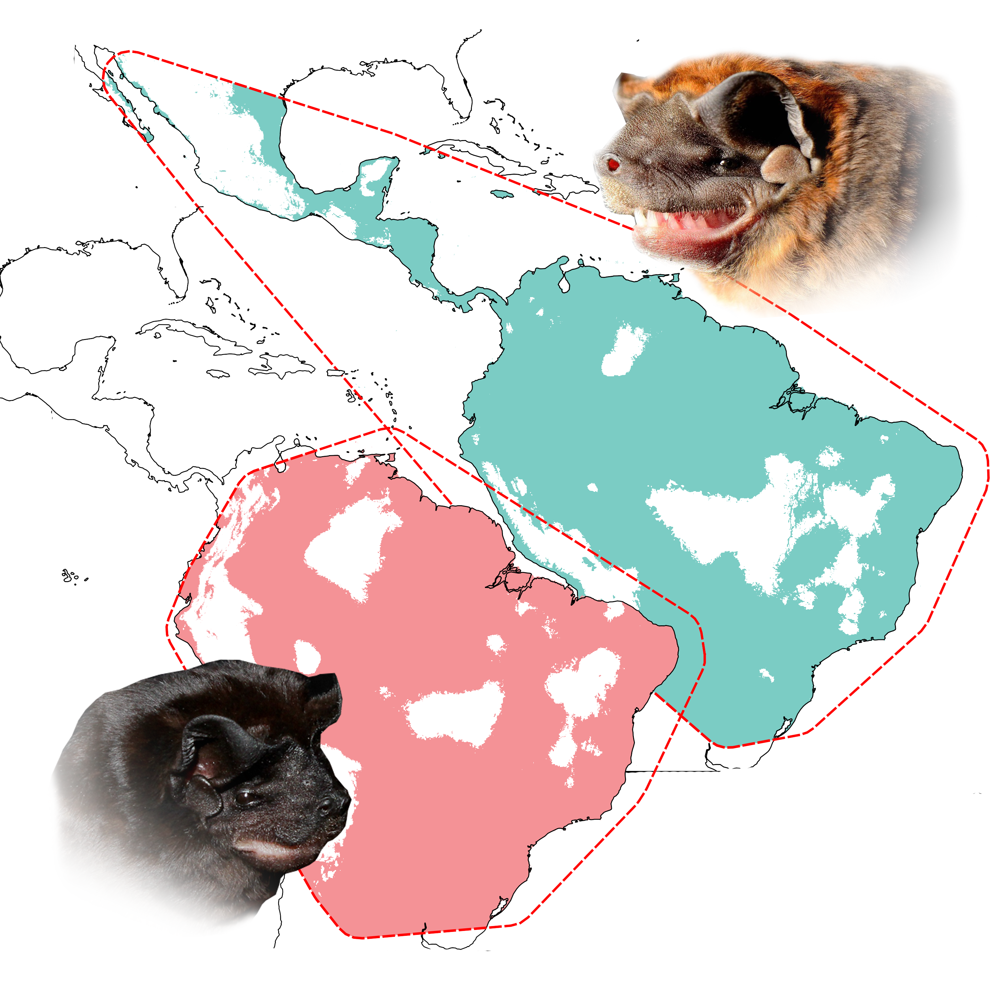

## Distribution of Promops nasutus and Promops centralis (Chiroptera: Molossidae) in South America: insights from acoustic evidence
### _Orlando Fabián Hernández-Leal[*](https://www.researchgate.net/profile/Orlando-Hernandez-Leal/research), Omar Daniel Leon-Alvarado[*](https://www.researchgate.net/profile/Omar-Leon-Alvarado), Aída Otálora-Ardila[*](https://www.researchgate.net/profile/Aida_Otalora-Ardila), Angélica V. Yantén[*](https://www.researchgate.net/profile/Angelica-Yanten-Arevalo), Maria Camila Valdés-Cardona[*](https://www.researchgate.net/profile/Maria-Camila-Valdes-Cardona/research), Camila A. Díaz-B[*](https://www.researchgate.net/profile/Camila-A-Diaz-B), Jefferson Sánchez[*](https://www.researchgate.net/profile/Jefferson-Sanchez-9), Leidy Azucena Ramírez-Fráncel[*](https://www.researchgate.net/profile/Leidy-Ramirez-Francel/research), Diego Lizcano[*](https://www.researchgate.net/profile/Diego-Lizcano/research), and Francisco Sánchez[*](https://www.researchgate.net/profile/Francisco-Sanchez-35/research)_
___

 

This repository contains the [input](https://github.com/oleon12/Promops/tree/main/Input) data used to build the Ecological Niche Mododels (ENM) of each species, and the [results](https://github.com/oleon12/Promops/tree/main/Models) of them. 

 

Also, the results of this study can be found as an interactive map [here](https://rpubs.com/oleon12/Promops)

 

